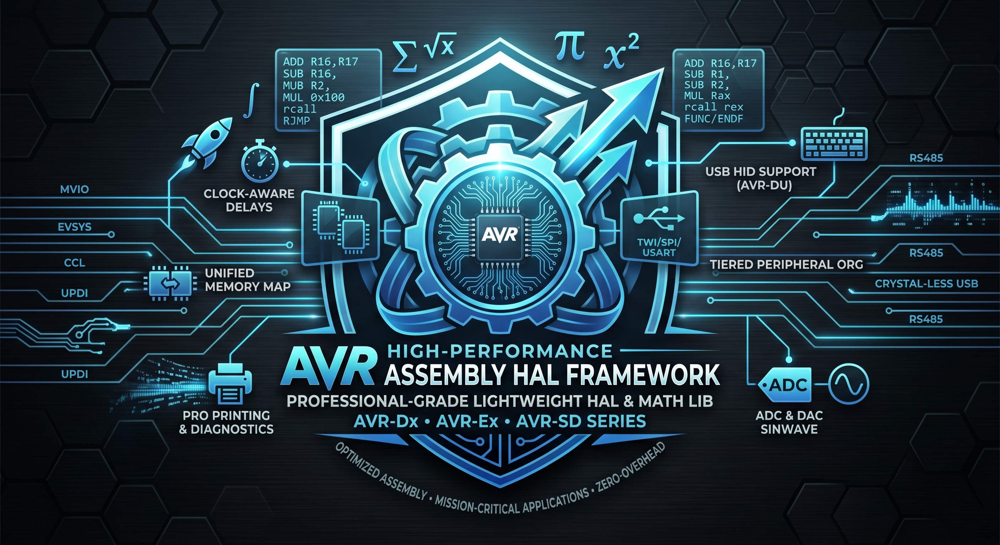

# AVR Assembly HAL Framework

A professional-grade, lightweight **Hardware Abstraction Layer (HAL)** and **Mathematical Library** for modern AVR microcontrollers (AVR-Dx, AVR-Ex and AVR-SD series). Built entirely in optimized assembly, this framework provides a high-performance foundation for mission-critical embedded applications.



---

## 🎯 Key Features

- **🎯 Zero-Overhead Abstraction**: Clean, linkable function definitions using `FUNC` and `ENDF` macros.
- **🕒 Clock-Aware Timing**: Automatic frequency adjustment for cycle-accurate delays and peripheral baud rates.
- **🧮 High-Performance Math**: Optimized 16-bit, 32-bit, and 64-bit routines for signed/unsigned multiplication, division, and multi-byte shifts.
- **🚀 Extended ISA**: Rich set of macros for 16, 32, and 64-bit operations (`ldi2/4/8`, `add2/4/s`, `cp2/4`, etc.) on an 8-bit core.
- **🚀 Unified Memory Mapping**: Seamlessly access strings and tables in Flash as if they were in SRAM via `MAPPED_PROGMEM_START`.
- **📊 Tiered Peripheral Organization**: Scalable, context-based architecture supporting instance-based handles for TWI/SPI/USART and direct static dispatch for system peripherals.
- **📠 Professional Printing**: Robust string and numeric formatting (UINT8-UINT64, Hex) for diagnostic output.
- **⚡ Modern AVR Support**: Full support for Dx/Ex/DU/EB series features, including UPDI programming, Event System (EVSYS), Configurable Custom Logic (CCL), and Crystal-less USB.
- **📠 USB HID Support**: Comprehensive USB Device Controller helper for the AVR-DU family with HID Keyboard enumeration capabilities.
- **🌊 Waveform Generation**: Integrated Sinewave generator with optimized quarter-wave lookup tables and 10-bit DAC support.

---

## 📂 Project Structure

### 🛠️ Modular HAL (`hal/`)

- **`all.S`**: Master include file—integrates the entire framework.
- **`core/`**: Primitives and essential data structures:
  - `macro.S`: Function wrappers (`FUNC`/`ENDF`), ISR helpers, register defines, and `ASCIZ`.
  - `extend.S`: Instruction set extensions (16-64 bit multi-byte operations).
  - `delay.S`: Frequency-aware cycle-accurate delays.
  - `print.S` / `print_num.S` / `print_hex.S` / `debug.S`: Diagnostic printing engine.
  - `devicebuffer.S`: Handle-based Ring Buffer (Circular Buffer).
  - `doublebuffer.S`: High-speed Ping-Pong buffer.
- **`dev/`**: On-chip peripheral drivers:
  - `usart.S`, `twi.S`, `spi.S`: Serial, I2C, and SPI communications.
  - `adc_v1.S` / `adc_v2.S`: ADC drivers with automatic sample calibration.
  - `tca.S` / `tce.S`: Advanced 16-bit Timers with PWM scaling.
  - `clkctrl.S`, `rtc.S`, `wdt.S`, `bod.S`, `dac.S`, `ac.S`, `vref.S`, `slpctrl.S`, `errctrl.S`, `pin.S`, `portmux.S`.
  - `usb.S`, `usb_ep0.S`, `usb_def.S`, `usb_hid_def.S`, `usb_struct.S`: USB Device Controller stack.
- **`math/`**: Core mathematical routines:
  - `mul.S`, `div.S`, `shifts.S`, `cast.S`: High-performance 16/32/64-bit arithmetic.
- **`def/`**: Target register map defines and generator script (`gen_defines_gc.sh`).

### 📟 Board Support (`boards/`)

Device-specific configurations for standard Curiosity Nano boards:
`attiny3217`, `attiny3227`, `avr128da48`, `avr128db48`, `avr16eb32`, `avr32sd32`, `avr64dd32`, `avr64du32`, `avr64ea48`.

---

## 🧪 Demonstration Examples

Ready-to-flash implementations in the `examples/` directory:

- **01-05**: Basic I/O, buffered printing, and loopback/double-buffering.
- **06_math_lib**: Comprehensive validation suite for 16-64 bit math.
- **07-16**: RTC, Device ID, Debugging, Clock Scaling, Watchdog, Brownout, and ADC features.
- **17-20**: I2C (TWI) Bus Scanner, UV sensor, Temperature sensor, and MCP9700B integration.
- **21-23**: SPI EtherCAT, TCE PWM Scaling, and Error Controller management.
- **24_dac_sinewave**: High-resolution sine wave generation using DAC and symmetry-optimized lookup tables.
- **25_opamp_voltage_follower**: Configurable analog gain stages using internal resistor ladders.
- **26_usb_hid / 27_usb_hello_world**: Crystal-less USB HID Keyboard implementations for the AVR-DU family.
- **28_rs485_heartbeat / 29_my_c_code**: RS485 communication and C/Assembly interoperability.

---

## 🛠️ Getting Started

### Prerequisites

```bash
sudo apt install gcc-avr avrdude avr-libc
```

### Build & Flash

Use the `curiosity.sh` script for MCU auto-detection, Linker Relaxation optimization, and flashing.

```bash
./curiosity.sh [-debug] <BOARD_NAME> <PROGRAM_FILE>
```

**Example:**

```bash
./curiosity.sh avr16eb32_cnano examples/05_double_buffered/main.S
```

### Fuse Management

Manage device configuration using `avr_fuses.sh`:

```bash
# Read all fuses
./avr_fuses.sh avr16eb32 read

# Write a specific fuse
./avr_fuses.sh avr16eb32 write fuse2 0x02
```

---

## 📜 HAL ABI (The Social Contract)

The framework follows a strict **Tiered Organization** and register usage policy to prevent clashing in multi-peripheral applications.

| Register          | Usage                  | Contract                                                                                        |
| :---------------- | :--------------------- | :---------------------------------------------------------------------------------------------- |
| **`Z (r31:r30)`** | **Instance Handle**    | Points to the active SRAM Descriptor (Buffer, TWI Handle, etc.). Functions treat `Z` as `self`. |
| **`Y (r29:r28)`** | **Hardware Pointer**   | Used internally by HAL functions for I/O base addresses. **Callee-saved.**                      |
| **`X (r27:r26)`** | **Streaming Pointer**  | Primary for data movement (Flash strings, SRAM arrays).                                         |
| **`r25:r22`**     | **Arguments / Return** | Standard 8/16/32-bit register bank for passing values.                                          |

### Peripheral Tiers

1. **Tier A (Streaming)**: USART, USB. Requires Ring Buffers + Instance Handles.
2. **Tier B (Control)**: TWI, SPI, TCA/B, ADC. Requires Instance Handles (No Buffers).
3. **Tier C (System)**: WDT, CLKCTRL, SLPCTRL. Direct Macros / Static Dispatch (No Handles).

### Preservation Rule

Any function that modifies `X`, `Y`, or `Z` for its own internal logic **must** preserve them (PUSH/POP), unless it is explicitly a "Context Selector" function intended to update the active handle.

## 📖 Usage Example

```assembly
; -----------------------------------------------------------------------------
; Function: main
; Description: Example entry point. Toggles LED and prints heartbeat message.
; -----------------------------------------------------------------------------
FUNC main
    rcall   HAL_BOARD_SETUP                   ; Board-specific I/O init
    _DEVBUFFER(RX_DEVBUFFER, 128, USART_ADDR) ; Initialize the USART ring buffer
    _STR("__ CURIOSITY ASSEMBLY __ \r\n")$ _STR_FLUSH()

  loop:
    _PORT_TGL(BOARD_LED_PORT, BOARD_LED_PIN)      ; Toggle LED via hardware register
    _DELAY_MS(500)                                ; Frequency-aware delay
    _STR("Heartbeat...\r\n")$ _STR_FLUSH()
    rjmp    loop
ENDF main
```

---

## ⚖️ License

Distributed under the **GNU General Public License v3.0**. See `LICENSE` for details.

---

## ❤️ Credits

AVR was the family that started it all for me. Returning to it after years of development on other platforms has been a total joy.

The modern AVR-Dx and AVR-Ex series introduce a powerhouse of features: a Unified Memory Map, UPDI, the Event System (EVSYS), and Configurable Custom Logic (CCL). Combined with Multi-Voltage I/O (MVIO), Atomic Port manipulation, crystal-less USB, and revamped peripherals (USART, ADC, and Timers), this architecture is a massive leap forward.

This project was born from a desire to create a high-performance Assembly boilerplate that leverages these modern features while capturing the elegant simplicity of writing in Assembly.

Developed for the modern AVR enthusiast.
